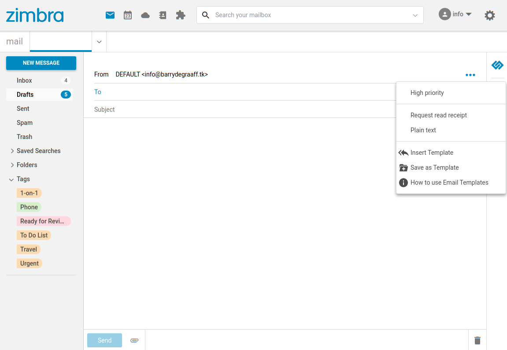
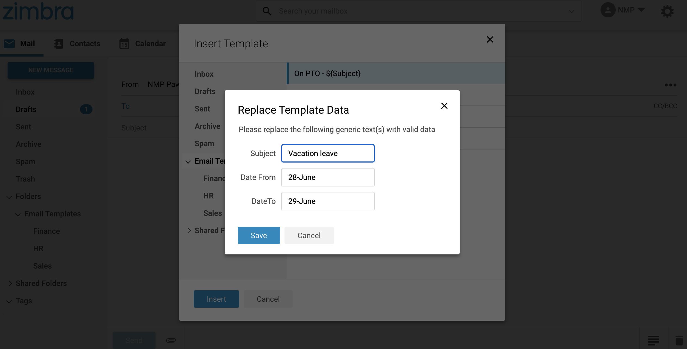
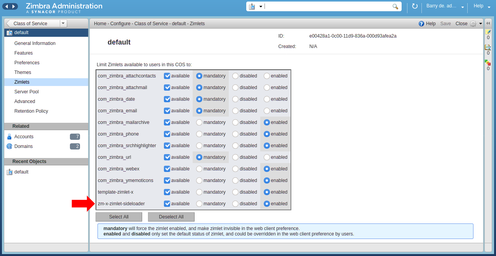

# zimbra-zimlet-email-templates
This is a Zimlet that helps the user to maintain and use Email Templates. An User will use templates when s/he has to send a lot of 'similar looking' emails with small changes. Consider an Accountant in the finance department sending invoices at the end of the month. The Accountant will create an invoice template with all the boiler plate text in it, leaving placeholders in the template where the changing data needs to go. When it is time to send out the actual invoices, the accountant will do the following:
* Compose a new email.
* Insert the invoice template into this new email.
* While inserting user will replace the actual values for the placehoder.
* Send the email.

Thus this Zimlet eases the user's job when they need to send many emails with boiler plate content and with small changes for each instance

## Loading the Zimlet
Like all other Zimlets, this one will also be available to the user when the Administrator enables it.
On compose mail, when we see a templates button at bottom-right, that means this zimlet is loaded.

## Creating a new template
User creates a template with all the boiler-plate text and placeholders as follows.
* Compose a mail like normal message. (Click on "New Message" button in the Mail tab)
* Add the boler-plate text as necessary
* We can add placeholders where appropriate using dollar sign with any variable name in curly braces as ${PLACEHOLDER_NAME}
* Placeholder names are case-sensitive. Placeholder name can use albhabets, numbers, dash, underscore, dot and space character.

## Save a template
* Once we create a new template with above steps, click on "Save as Template" option.
* It will show the list of folders to save the template. User can select any folder and save the template.
* We can also save templates in any "Shared Folders" having write permission to the folder.

## Composing email with template
* Click on "New Message" button in the Mail tab to compose a new message.
* Click on the body of composer area to place the cursor.
* Click on "Insert Template" options, it will show the list of folders in a dialog 
* Click on any folder and it will list templates under that folder.
* Click on any template and click "Insert" button to load that template.
* User can insert as many templates as he wishes.
* Templates are saved as nothing but regular emails. In that sense any previously existing email can be used in the Insert dialogue.

## Screenshots
> 
*This button shows email templates zimlet is loaded.*

> 
*Insert Template - Lists folders and templates under the clicked folder.*

> 
*Template having placeholders - asks user to fill values for placeholders.*

> 
*Example of placeholder template.*

> 
*Save as Template - Click on any folder where you want to save this template.*

## Instructions for developers

## Prerequisites 

To follow the steps in this article you need a Zimbra test server. You will need to have Zimbra 9 Network Edition. You can set this up in a Virtual Machine in the cloud or you can install it on your local computer inside VirtualBox/KVM/Parallels etc. If you decide to set it up on your local computer you need at least an i5 with 16GB of RAM and a SSD. Your test server needs to be accessible over SSH. Instructions on how to set up your Zimbra server: https://blog.zimbra.com/2018/01/install-zimbra-collaboration-8-8-ubuntu-16-04-lts/ make sure to install the latest patches. You can find instructions on how to install patches at https://wiki.zimbra.com/wiki/Zimbra_Releases

## Deploy the Zimlet Sideloader

You need to deploy and enable the Zimlet Sideloader on your development server. You only have to do this step once. 

      yum install zimbra-zimlet-sideloader
      apt install zimbra-zimlet-sideloader
      su - zimbra
      zmmailboxdctl restart


*Verify that the Sideloader Zimlet is available and enabled for your Zimbra Class of Service (CoS) by logging into the Admin UI -> Home -> Configure -> Class of Service.*


*Verify that the Sideloader Zimlet is available and enabled for your Zimbra and account by logging into the Admin UI -> Home -> Manage -> Accounts.*

## Installing Zimlet CLI

You can develop Zimbra Zimlets on any OS supported by NodeJS (https://nodejs.org/en/download/). This article will include Linux commands you can run on CentOS/Fedora/Redhat and Ubuntu. If you run on a different OS reading these commands should help you understand what you must do to get started. 

Zimbra provides a tool called Zimlet CLI that is based on Webpack. It is used for building/packaging your Zimlet and for working with Zimlet templates. Install it on your local computer:

As root:

      yum install nodejs
      apt install nodejs
      npm install -g @zimbra/zimlet-cli


## Downloading and running the Email Templates Zimlet

Create a folder on your local computer to store the Email Templates Zimlet:

      mkdir templates_zimlet
      cd templates_zimlet
      git clone git@github.com:ZimbraOS/zimbra-zimlet-email-templates.git
      cd zimbra-zimlet-email-templates
      npm install
      zimlet watch

The output of this command should be:

```
Compiled successfully!

You can view the application in browser.

Local:            https://localhost:8081/index.js
On Your Network:  https://192.168.1.100:8081/index.js
```

Visit https://localhost:8081/index.js in your browser and accept the self-signed certificate. The index.js is a packed version of the `Email Templates Zimlet`. More information about the zimlet command, npm and using SSL certificates can be found in https://github.com/Zimbra/zm-zimlet-guide. 

## Sideload the email templates Zimlet

Log on to your Zimbra development server and make sure that you are seeing the modern UI. Then append `/sdk/zimlets` to the URL.

> 
*Sideload the Email Templates Zimlet by clicking Load Zimlet. The Zimlet is now added to the Zimbra UI in real-time. No reload is necessary.*

For detailed explanation on how things work, checkout the [CLI Readme](https://github.com/zimbra/zimlet-cli/blob/master/README.md).

## Visual Studio Code

Open the folder `~/templates_zimlet/zimbra-zimlet-email-templates` in Visual Studio code to take a look at the code in the Email Templates Zimlet. More information on this can be found at: https://github.com/Zimbra/zm-zimlet-guide.

## How to implement the feature

First step is to implement the Zimlet slot `compose-footer-right-btn`. This is done in 

* ~/templates_zimlet/zimbra-zimlet-email-templates/src/index.js

```javascript
import { createElement } from 'preact';
import withIntl from './enhancers';
import TemplateOptions from './components/template-options';

export default function Zimlet(context) {
	const { plugins } = context;
	const exports = {};

	exports.init = function init() {
		plugins.register('slot::compose-footer-right-btn', templateBtn);
	};

	const templateBtn = withIntl()(props => {
		return (
			<TemplateOptions
				getMessage={props.getMessage}
				insertAtCaret={props.insertAtCaret}
				subjectInput={props.subjectInput}
				context={context}
			/>
		);
	});
	return exports;
}

```

It is important to understand that the compose-footer-right-btn Zimlet slot passes on to our Zimlet the getMessage, insertAtCaret prop. We use this getMessage prop to get the composed message and insertAtCaret prop is used to set the template content in the body of composer. This piece of code calls methods from Composer component from Zimbra core when user inserts or saves a template.

```javascript
this.props.insertAtCaret(msgBody, false);
```

```javascript
const msg = this.props.getMessage();
```
